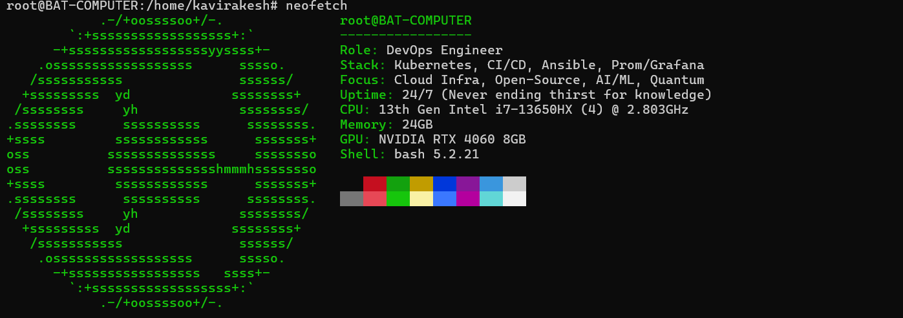

  

---
<!-- TYPING ANIMATION -->

---

<!-- LANGS -->
### `> ls langs/`

---

### `> ls tools/`

<!-- Container & Runtime -->

<!-- Orchestration & Kubernetes Ecosystem -->

<!-- Storage -->

<!-- Backup & DR -->

<!-- Virtualisation -->

<!-- OS & Platform -->

<!-- Monitoring -->

<!-- IaC & Automation -->

<!-- Databases -->

<!-- Identity & Security -->

<!-- Networking & Misc -->

---

<!-- GITHUB STATS -->
### `kavirakesh@:~$ curl -sSL https://api.github.com/users/kavirakesh14/metrics | jq`

